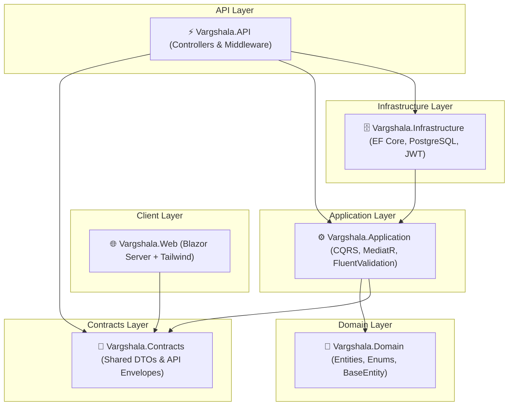

<div align="center">

# 🎓 Vargshala (वर्गशाला)
**Multi-Tenant Coaching & Educational Institute Management SaaS**

[](https://dotnet.microsoft.com/)
[](https://www.postgresql.org/)
[](https://dotnet.microsoft.com/apps/aspnet/web-apps/blazor)
[](https://tailwindcss.com/)
[](docs/01_ARCHITECTURE.md)
[](LICENSE)

<p align="center">
  A modern, scalable, enterprise-grade multi-tenant SaaS platform built for coaching centers, tuition classes, and educational institutes.
</p>

[Explore Documentation](docs/00_PROJECT_OVERVIEW.md) • [Architecture Guide](docs/01_ARCHITECTURE.md) • [Database Rules](docs/03_DATABASE_RULES.md) • [API Conventions](docs/04_API_CONVENTIONS.md)

</div>

---

## 🌟 Key Highlights

- 🏢 **Multi-Tenancy**: Shared database, shared schema with strict `OrganizationId`-based tenant isolation enforced at the data and authentication layer.
- 🏛️ **Clean Modular Monolith**: Strict architectural boundaries with Domain, Application, Infrastructure, API, and Blazor Web layers.
- 🔐 **JWT Authentication & RBAC**: Access + Refresh token rotation, claims-based authorization supporting `SuperAdmin`, `OrganizationAdmin`, `Teacher`, and `Student`.
- ⚡ **Automated Tailwind CSS**: Built-in standalone Tailwind CSS engine compiling during `dotnet build` with zero Node.js/npm runtime dependency.
- 📦 **Central Package Management (CPM)**: Single point of control for all NuGet package versions in `Directory.Packages.props`.
- 🔄 **CQRS & MediatR Pipeline**: Decoupled use cases with automated FluentValidation and performance logging behaviors.
- 💾 **PostgreSQL & EF Core**: Global soft-delete query filters (`!IsDeleted`) and automated audit trail stamping (`CreatedAt`, `CreatedBy`, `UpdatedAt`, `UpdatedBy`).

---

## 🏛️ Solution Architecture



### Layer Responsibilities

| Project | Responsibility | Dependencies |
|---|---|---|
| **`Vargshala.Domain`** | Pure business entities (`Organization`, `User`, `BaseEntity`), Enums (`Role`), Domain Exceptions. | **None (Zero external dependencies)** |
| **`Vargshala.Contracts`** | Transport DTOs, request/response models, generic `ApiResponse<T>` envelope. | **None** |
| **`Vargshala.Application`** | CQRS use cases, MediatR handlers, FluentValidation rules, pipeline behaviors. | `Domain`, `Contracts` |
| **`Vargshala.Infrastructure`** | EF Core `VargshalaDbContext`, PostgreSQL migrations, JWT service, BCrypt hashing. | `Application` |
| **`Vargshala.API`** | REST endpoints, Swagger OpenAPI with JWT Bearer, exception handling middleware. | `Application`, `Infrastructure`, `Contracts` |
| **`Vargshala.Web`** | Blazor interactive UI, components, Tailwind CSS styling. | `Contracts` |
| **`Vargshala.UnitTests`** | xUnit unit tests verifying domain & use case handlers. | `Application`, `Domain` |
| **`Vargshala.IntegrationTests`** | Integration tests validating API endpoints & tenant isolation. | `API`, `Infrastructure` |

---

## 📁 Repository Structure

```
vargshala/
├── src/
│   ├── Vargshala.Domain/            # Business domain entities & SQL DDL scripts
│   │   ├── Common/BaseEntity.cs     # Audit & soft delete base entity
│   │   ├── Entities/                # Organization, User
│   │   ├── Enums/Role.cs            # SuperAdmin (1), OrgAdmin (2), Teacher (3), Student (4)
│   │   └── Db/Tables/               # Raw PostgreSQL table DDL & seed scripts
│   │
│   ├── Vargshala.Contracts/         # Shared transport DTOs
│   │   ├── Authentication/          # Login, Register, RefreshToken contracts
│   │   ├── Organizations/           # OrganizationDto
│   │   ├── Users/                   # UserDto, CreateUserRequest
│   │   └── Common/                  # ApiResponse<T>, PagedResponse<T>
│   │
│   ├── Vargshala.Application/       # Use cases & business logic
│   │   ├── Abstractions/            # ITokenService, ICurrentUser, IVargshalaDbContext
│   │   ├── Features/                # CQRS commands, queries, validators
│   │   └── Behaviors/               # ValidationBehavior, LoggingBehavior
│   │
│   ├── Vargshala.Infrastructure/    # External systems & database
│   │   ├── Persistence/             # VargshalaDbContext, Configurations, Migrations
│   │   └── Authentication/          # JwtTokenService, BcryptPasswordHasher
│   │
│   ├── Vargshala.API/               # REST API HTTP entrypoint
│   │   ├── Controllers/             # AuthController, OrganizationsController, UsersController
│   │   └── Middleware/              # ExceptionHandlingMiddleware
│   │
│   └── Vargshala.Web/               # Blazor Web App
│       ├── Components/              # Layouts, Pages, Routes
│       ├── Styles/app.css           # Tailwind input stylesheet
│       └── tailwind.config.js       # Tailwind configuration
│
├── tests/
│   ├── Vargshala.UnitTests/         # Unit test suite
│   └── Vargshala.IntegrationTests/  # Integration test suite
│
├── docs/                            # Complete architectural documentation set (00-13)
├── Directory.Build.props            # Centralized build settings
├── Directory.Packages.props         # Central Package Management
├── Vargshala.sln                    # Visual Studio Solution
└── README.md
```

---

## 🚀 Getting Started

### Prerequisites

- [.NET 10 SDK](https://dotnet.microsoft.com/download)
- [PostgreSQL 14+](https://www.postgresql.org/download/)

### 1. Clone the Repository

```bash
git clone https://github.com/Rishabhks45/vargshala.git
cd vargshala
```

### 2. Configure Database Connection

Update connection string in `src/Vargshala.API/appsettings.json`:

```json
{
  "ConnectionStrings": {
    "DefaultConnection": "Host=localhost;Port=5432;Database=vargshala;Username=postgres;Password=YOUR_PASSWORD"
  }
}
```

### 3. Run Migrations & Seed Database

```bash
# Apply EF Core migrations
dotnet ef database update --project src/Vargshala.Infrastructure --startup-project src/Vargshala.API
```

*(Note: In Development mode, `DbInitializer` automatically seeds default admin accounts and initial organization on startup!)*

### 4. Build & Run

```bash
# Build entire solution (Tailwind CSS compiles automatically)
dotnet build Vargshala.sln

# Run Backend API (Swagger available at: https://localhost:7000/swagger)
dotnet run --project src/Vargshala.API

# Run Blazor Web App (https://localhost:7001)
dotnet run --project src/Vargshala.Web
```

### 5. Run Test Suite

```bash
dotnet test Vargshala.sln
```

---

## 🔑 Default Seed Credentials

| Role | Email | Default Password | Scope |
|---|---|---|---|
| **SuperAdmin** | `rishabh.sharma@vargshala.com` | `Admin@12345` | Global Platform Operator (No Organization) |
| **OrganizationAdmin** | `rishabh.admin@vargshala.com` | `Admin@12345` | Vargshala Institute (`VARGSHALA`) |

---

## 📡 Core API Endpoints

### Authentication (`/api/v1/auth`)
- `POST /api/v1/auth/register` — Register a new Organization + Admin user
- `POST /api/v1/auth/login` — Authenticate and receive JWT + Refresh Token
- `POST /api/v1/auth/refresh` — Rotate expired access token using refresh token

### Organizations (`/api/v1/organizations`)
- `GET /api/v1/organizations/me` — Retrieve current user's organization profile *(Requires Bearer Token)*

### Users (`/api/v1/users`)
- `POST /api/v1/users` — Create student/teacher within current organization *(Admin only)*
- `GET /api/v1/users` — Paginated user listing scoped strictly to current organization

---

## 🗺️ Roadmap

- [x] **Phase 1: Foundation** — Solution setup, Clean Architecture, PostgreSQL, JWT Auth, Multi-Tenancy, Automated Tailwind.
- [ ] **Phase 2: Academic Core** — Teachers, Students, Batches, Subjects, Enrollment.
- [ ] **Phase 3: Learning & Fees** — Fee Plans, Invoices, Payments, Study Material & Notes.
- [ ] **Phase 4: Assessments** — Online Quizzes, Question Banks, Auto-grading & Result Analytics.
- [ ] **Phase 5: Communication** — Institute Announcements, Group Discussions, Direct Messaging.
- [ ] **Phase 6: Advanced Analytics** — Institute Performance Dashboard & Multi-branch Reports.

---

## 🤝 Contributing

1. Fork the repository
2. Create your feature branch (`git checkout -b feature/AmazingFeature`)
3. Commit your changes (`git commit -m 'Add some AmazingFeature'`)
4. Push to the branch (`git push origin feature/AmazingFeature`)
5. Open a Pull Request

---

## 📄 License

This project is licensed under the MIT License — see the [LICENSE](LICENSE) file for details.

<div align="center">
  <sub>Built with ❤️ by Rishabh Sharma for Vargshala</sub>
</div>
