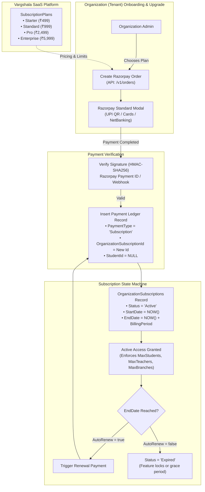
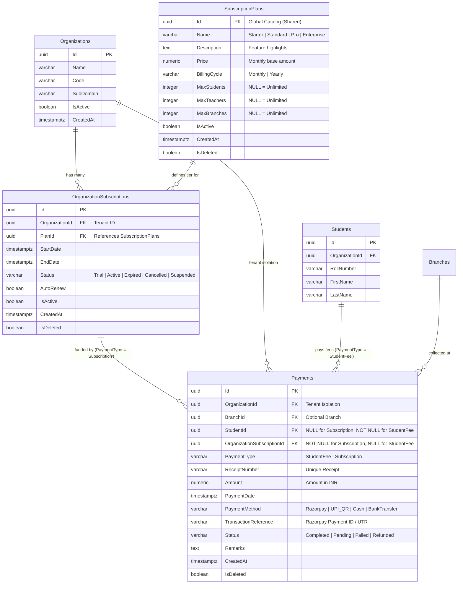

# Vargshala SaaS Subscription & Payments Architecture (ERD & SQL Blueprint)

> **Reference Specification**: Based on [`Vargshala_SaaS_Subscription_Payments.md`](file:///d:/Rishabhks45/vargshala/Vargshala_SaaS_Subscription_Payments.md)  
> **Tech Stack**: ASP.NET Core (.NET 10), EF Core, PostgreSQL (Supabase), Razorpay Gateway  
> **Rule Compliance**: Multi-Tenant Isolation via `OrganizationId`, Clean Architecture, Theme 4 Deep Teal UI  

---

## 1. Complete Business & Lifecycle Flow



---

## 2. Entity-Relationship (ER) Diagram

### 2.1. Mermaid ERD


### 2.2. ASCII Architecture Diagram (From Specification)

```text
┌──────────────────────┐
│    Organizations     │
├──────────────────────┤
│ Id (PK)              │
│ Name                 │
└──────────┬───────────┘
           │ 1
           │
           │ N
           ▼
┌──────────────────────────────┐
│  OrganizationSubscriptions   │
├──────────────────────────────┤
│ Id (PK)                      │
│ OrganizationId (FK)          │
│ PlanId (FK)                  │
│ StartDate                    │
│ EndDate                      │
│ Status                       │
│ AutoRenew                    │
│ CreatedAt                    │
│ IsDeleted                    │
└──────────────┬───────────────┘
               │ N
               │
               │ 1
               ▼
┌────────────────────────┐
│   SubscriptionPlans    │
├────────────────────────┤
│ Id (PK)                │
│ Name                   │
│ Price                  │
│ BillingCycle           │
│ MaxStudents            │
│ MaxTeachers            │
│ MaxBranches            │
│ IsActive               │
└────────────────────────┘

OrganizationSubscriptions ───< Payments (PaymentType = 'Subscription')
                                   │
                                   │ Unified Ledger
                                   │
StudentFees / Students   ───< Payments (PaymentType = 'StudentFee')
```

---

## 3. SQL Queries For Manual Database Execution (By User)

> [!IMPORTANT]
> Run the following **4 queries in order** in your PostgreSQL / Supabase SQL Editor.  
> Every statement is idempotent (`IF NOT EXISTS`, `ON CONFLICT`) and safe to run.

### Step 1: Create `SubscriptionPlans` Table
*File reference: [`src/Vargshala.Domain/Db/Tables/31_SubscriptionPlans.sql`](file:///d:/Rishabhks45/vargshala/src/Vargshala.Domain/Db/Tables/31_SubscriptionPlans.sql)*

```sql
CREATE TABLE IF NOT EXISTS public."SubscriptionPlans"
(
    "Id" uuid NOT NULL,
    "Name" varchar(100) NOT NULL,
    "Description" text,
    "Price" numeric(12,2) NOT NULL,
    "BillingCycle" varchar(20) NOT NULL DEFAULT 'Monthly',
    "MaxStudents" integer,
    "MaxTeachers" integer,
    "MaxBranches" integer,
    "IsActive" boolean NOT NULL DEFAULT true,

    "CreatedBy" uuid,
    "CreatedAt" timestamp with time zone NOT NULL DEFAULT CURRENT_TIMESTAMP,
    "UpdatedBy" uuid,
    "UpdatedAt" timestamp with time zone,
    "IsDeleted" boolean NOT NULL DEFAULT false,
    "DeletedBy" uuid,
    "DeletedAt" timestamp with time zone,

    CONSTRAINT "PK_SubscriptionPlans" PRIMARY KEY ("Id"),
    CONSTRAINT "CK_SubscriptionPlans_Price" CHECK ("Price" >= 0),
    CONSTRAINT "CK_SubscriptionPlans_MaxStudents" CHECK ("MaxStudents" IS NULL OR "MaxStudents" > 0),
    CONSTRAINT "CK_SubscriptionPlans_MaxTeachers" CHECK ("MaxTeachers" IS NULL OR "MaxTeachers" > 0),
    CONSTRAINT "CK_SubscriptionPlans_MaxBranches" CHECK ("MaxBranches" IS NULL OR "MaxBranches" > 0)
);

CREATE INDEX IF NOT EXISTS "IX_SubscriptionPlans_IsActive"
ON public."SubscriptionPlans" ("IsActive")
WHERE "IsDeleted" = false;
```

---

### Step 2: Create `OrganizationSubscriptions` Table
*File reference: [`src/Vargshala.Domain/Db/Tables/32_OrganizationSubscriptions.sql`](file:///d:/Rishabhks45/vargshala/src/Vargshala.Domain/Db/Tables/32_OrganizationSubscriptions.sql)*

```sql
CREATE TABLE IF NOT EXISTS public."OrganizationSubscriptions"
(
    "Id" uuid NOT NULL,
    "OrganizationId" uuid NOT NULL,
    "PlanId" uuid NOT NULL,
    "StartDate" timestamp with time zone NOT NULL,
    "EndDate" timestamp with time zone NOT NULL,
    "Status" varchar(20) NOT NULL DEFAULT 'Trial',
    "AutoRenew" boolean NOT NULL DEFAULT false,
    "IsActive" boolean NOT NULL DEFAULT true,

    "CreatedBy" uuid,
    "CreatedAt" timestamp with time zone NOT NULL DEFAULT CURRENT_TIMESTAMP,
    "UpdatedBy" uuid,
    "UpdatedAt" timestamp with time zone,
    "IsDeleted" boolean NOT NULL DEFAULT false,
    "DeletedBy" uuid,
    "DeletedAt" timestamp with time zone,

    CONSTRAINT "PK_OrganizationSubscriptions" PRIMARY KEY ("Id"),
    CONSTRAINT "FK_OrganizationSubscriptions_Organizations"
        FOREIGN KEY ("OrganizationId") REFERENCES public."Organizations" ("Id") ON DELETE RESTRICT,
    CONSTRAINT "FK_OrganizationSubscriptions_SubscriptionPlans"
        FOREIGN KEY ("PlanId") REFERENCES public."SubscriptionPlans" ("Id") ON DELETE RESTRICT,
    CONSTRAINT "CK_OrganizationSubscriptions_Date" CHECK ("EndDate" > "StartDate"),
    CONSTRAINT "CK_OrganizationSubscriptions_Status" CHECK (
        "Status" IN ('Trial', 'Active', 'Expired', 'Cancelled', 'Suspended')
    )
);

CREATE INDEX IF NOT EXISTS "IX_OrganizationSubscriptions_OrganizationId"
ON public."OrganizationSubscriptions" ("OrganizationId");

CREATE INDEX IF NOT EXISTS "IX_OrganizationSubscriptions_PlanId"
ON public."OrganizationSubscriptions" ("PlanId");

CREATE INDEX IF NOT EXISTS "IX_OrganizationSubscriptions_Status"
ON public."OrganizationSubscriptions" ("Status");

CREATE INDEX IF NOT EXISTS "IX_OrganizationSubscriptions_EndDate"
ON public."OrganizationSubscriptions" ("EndDate");
```

---

### Step 3: Alter Existing `Payments` Table
*File reference: [`src/Vargshala.Domain/Db/Tables/33_Alter_Payments_Add_Subscription.sql`](file:///d:/Rishabhks45/vargshala/src/Vargshala.Domain/Db/Tables/33_Alter_Payments_Add_Subscription.sql)*

```sql
-- 1. Make StudentId nullable (subscription payments belong to organization, not a student)
ALTER TABLE public."Payments" 
ALTER COLUMN "StudentId" DROP NOT NULL;

-- 2. Add PaymentType column ('StudentFee' or 'Subscription')
ALTER TABLE public."Payments"
ADD COLUMN IF NOT EXISTS "PaymentType" varchar(30) NOT NULL DEFAULT 'StudentFee';

-- 3. Add OrganizationSubscriptionId FK column
ALTER TABLE public."Payments"
ADD COLUMN IF NOT EXISTS "OrganizationSubscriptionId" uuid NULL;

-- 4. Add FK constraint if not already present
DO $$
BEGIN
    IF NOT EXISTS (
        SELECT 1 FROM pg_constraint WHERE conname = 'FK_Payments_OrganizationSubscriptions'
    ) THEN
        ALTER TABLE public."Payments"
        ADD CONSTRAINT "FK_Payments_OrganizationSubscriptions"
            FOREIGN KEY ("OrganizationSubscriptionId")
            REFERENCES public."OrganizationSubscriptions" ("Id")
            ON DELETE RESTRICT;
    END IF;
END $$;

-- 5. Create Indexes
CREATE INDEX IF NOT EXISTS "IX_Payments_OrganizationSubscriptionId"
ON public."Payments" ("OrganizationSubscriptionId");

CREATE INDEX IF NOT EXISTS "IX_Payments_PaymentType"
ON public."Payments" ("PaymentType");
```

---

### Step 4: Seed Default SaaS Packages
*File reference: [`src/Vargshala.Domain/Db/Tables/34_Seed_SubscriptionPlans.sql`](file:///d:/Rishabhks45/vargshala/src/Vargshala.Domain/Db/Tables/34_Seed_SubscriptionPlans.sql)*

```sql
INSERT INTO public."SubscriptionPlans" 
(
    "Id", "Name", "Description", "Price", "BillingCycle", 
    "MaxStudents", "MaxTeachers", "MaxBranches", "IsActive", "CreatedAt", "IsDeleted"
)
VALUES
(
    'a1111111-1111-1111-1111-111111111111',
    'Starter',
    'Perfect for solo tutors and small coaching centers starting out.',
    499.00,
    'Monthly',
    100,
    10,
    1,
    true,
    CURRENT_TIMESTAMP,
    false
),
(
    'a2222222-2222-2222-2222-222222222222',
    'Standard',
    'Our most popular plan for growing coaching institutes with 2 branches.',
    999.00,
    'Monthly',
    250,
    25,
    2,
    true,
    CURRENT_TIMESTAMP,
    false
),
(
    'a3333333-3333-3333-3333-333333333333',
    'Pro Institute',
    'Comprehensive management for multi-branch institutes and test prep academies.',
    2499.00,
    'Monthly',
    1000,
    100,
    5,
    true,
    CURRENT_TIMESTAMP,
    false
),
(
    'a4444444-4444-4444-4444-444444444444',
    'Enterprise',
    'Unlimited students, teachers, and branches with custom branding and priority support.',
    5999.00,
    'Monthly',
    NULL,
    NULL,
    NULL,
    true,
    CURRENT_TIMESTAMP,
    false
)
ON CONFLICT ("Id") DO UPDATE 
SET 
    "Price" = EXCLUDED."Price",
    "MaxStudents" = EXCLUDED."MaxStudents",
    "MaxTeachers" = EXCLUDED."MaxTeachers",
    "MaxBranches" = EXCLUDED."MaxBranches",
    "UpdatedAt" = CURRENT_TIMESTAMP;
```

---

## 4. Entity Framework Core Mapping Details

### 4.1. Domain Entities (`src/Vargshala.Domain/Entities/`)
- `SubscriptionPlan.cs` (Inherits `BaseEntity`, Global Catalog)
- `OrganizationSubscription.cs` (Inherits `BaseEntity`, Tenant Scoped)
- `Payment.cs` (Inherits `BaseEntity`, Tenant Scoped, with optional `StudentId` and optional `OrganizationSubscriptionId`)

### 4.2. EF Core Configurations (`src/Vargshala.Infrastructure/Persistence/Configurations/`)
- `SubscriptionPlanConfiguration.cs`: Maps table `"SubscriptionPlans"`, sets precision `HasPrecision(12, 2)`, applies query filter `!e.IsDeleted`.
- `OrganizationSubscriptionConfiguration.cs`: Maps table `"OrganizationSubscriptions"`, sets relationships `HasOne(e => e.Organization)` and `HasOne(e => e.Plan)`.
- `PaymentConfiguration.cs`: Configures `PaymentType`, optional `StudentId`, optional `OrganizationSubscriptionId`, sets foreign key to `OrganizationSubscriptions`.

---

## 5. Summary Table for Quick Reference

| Feature / Table | Primary Key | Foreign Keys | Tenant Isolation? | Purpose |
| :--- | :--- | :--- | :---: | :--- |
| **`SubscriptionPlans`** | `Id` (uuid) | *None* | ❌ No (Global) | Defines pricing tiers (Starter, Standard, Pro, Enterprise) |
| **`OrganizationSubscriptions`**| `Id` (uuid) | `OrganizationId`, `PlanId` | ✅ Yes (`OrganizationId`) | Tracks active subscription status & expiry of institutes |
| **`Payments`** | `Id` (uuid) | `OrganizationId`, `BranchId`, `StudentId` (opt), `OrganizationSubscriptionId` (opt) | ✅ Yes (`OrganizationId`) | Single unified ledger for both Student Fees and SaaS Plans |
