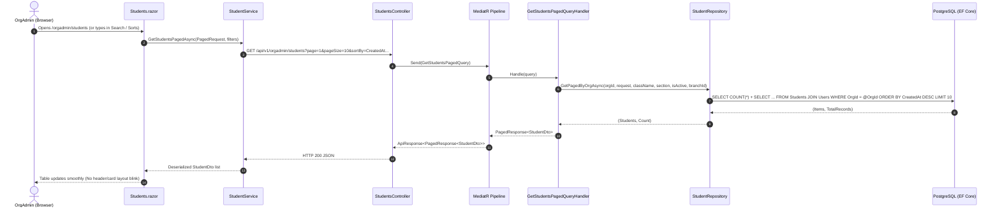
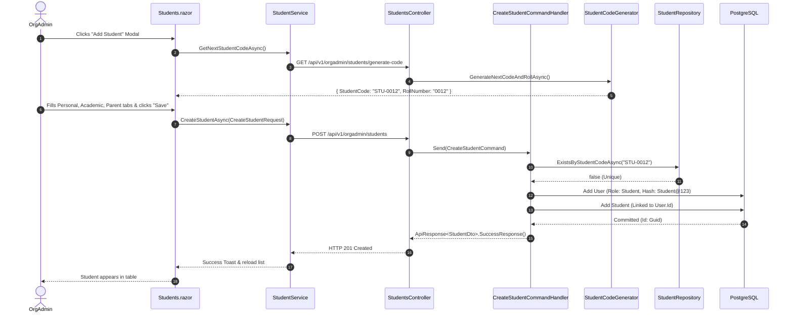

# Vargshala — Students Module Architecture & Structure (`docs/STUDENTS_STRUCTURE.md`)

> **Module**: Organization Admin — Students Management  
> **UI Component**: [`src/Vargshala.Web/Components/Pages/OrgAdmin/Students.razor`](file:///d:/Rishabhks45/vargshala/src/Vargshala.Web/Components/Pages/OrgAdmin/Students.razor)  
> **Architecture**: Clean Architecture (.NET 10 + Blazor Web + EF Core + MediatR + FluentValidation + PostgreSQL)  
> **Design Theme**: Theme 4 — Deep Teal (`#004D40` headers, `#009488` primary teal accents, `#00796b` gradients)  
> **Reference Standard**: [`src/Vargshala.Web/Components/Pages/ControlPanel/Users.razor`](file:///d:/Rishabhks45/vargshala/src/Vargshala.Web/Components/Pages/ControlPanel/Users.razor)

---

## 1. Executive Summary

The **Students Management** module is a core tenant-facing domain within the Vargshala Multi-Tenant Coaching SaaS. It allows Organization Administrators (`OrganizationAdmin`) and Branch Managers to manage the end-to-end student lifecycle:
- Student admissions, onboarding, and auto-generated unique student codes (`STU-XXXX`) and roll numbers.
- Dual-entity persistence: Linked ASP.NET Identity / SaaS `User` account + detailed `Student` academic/parent/contact profile.
- Server-side high-performance search, filtering (by Branch, Class, Section, Batch, Fee Status, Active Status), and whitelisted sorting.
- Multi-step student profile creation & editing modal tabs (Personal, Academic, Parent/Guardian, Address & Emergency).
- Batch enrollment, fee tracking / collection integration, and CSV bulk exports.

---

## 2. Layer-by-Layer Architecture Matrix

```
┌──────────────────────────────────────────────────────────────────────────────────┐
│                             1. Vargshala.Web (UI)                                │
│   Students.razor  •  IStudentService  •  StudentService  •  TableSortState       │
└────────────────────────────────────────┬─────────────────────────────────────────┘
                                         │ HTTP REST (JSON / ApiResponse<T>)
┌────────────────────────────────────────▼─────────────────────────────────────────┐
│                             2. Vargshala.API                                     │
│   StudentsController.cs [Authorize(Roles = "OrganizationAdmin,1")]                │
└────────────────────────────────────────┬─────────────────────────────────────────┘
                                         │ MediatR Send(IRequest<ApiResponse<T>>)
┌────────────────────────────────────────▼─────────────────────────────────────────┐
│                          3. Vargshala.Application                                │
│   Commands & Handlers (Create, Update, Delete)                                   │
│   Queries & Handlers (GetPaged, GetById, GetBatches, GetNextCode)                │
│   Helpers: IStudentCodeGenerator • Mapping: StudentMappingExtensions             │
│   Persistence Abstraction: IStudentRepository                                    │
└──────────────────┬─────────────────────────────────────────────┬─────────────────┘
                   │ Uses DTOs & Validation                      │ Implements Interface
┌──────────────────▼──────────────────────┐   ┌──────────────────▼─────────────────┐
│        4. Vargshala.Contracts           │   │    5. Vargshala.Infrastructure     │
│   StudentDto, CreateStudentRequest      │   │   StudentRepository.cs             │
│   UpdateStudentRequest, GeneratedCode   │   │   StudentConfiguration.cs          │
│   FluentValidation Validators           │   │   EF Core DbContext & Migrations   │
│   SharedKernel (Enums, Status)          │   │   Global Tenant Query Filters      │
└──────────────────┬──────────────────────┘   └──────────────────┬─────────────────┘
                   │ Depends on Entities                         │ Stores / Maps
┌──────────────────▼─────────────────────────────────────────────▼─────────────────┐
│                            6. Vargshala.Domain                                   │
│   Student.cs (BaseEntity)  •  1:1 User  •  1:N BatchStudent, Attendance, Fees   │
└──────────────────────────────────────────────────────────────────────────────────┘
```

---

## 3. Frontend Architecture (`src/Vargshala.Web`)

### 3.1 Primary Razor Page
- **File**: [`src/Vargshala.Web/Components/Pages/OrgAdmin/Students.razor`](file:///d:/Rishabhks45/vargshala/src/Vargshala.Web/Components/Pages/OrgAdmin/Students.razor)
- **Route**: `@page "/orgadmin/students"`
- **Access Level**: Organization Admin (`OrganizationAdmin`, `SuperAdmin`)
- **Injected Services**:
  - `IStudentService StudentService`: HTTP client for student CRUD operations.
  - `IBatchService BatchService`: Populates batch dropdown filters and batch assignment lists.
  - `IBranchContextService BranchContextService`: Provides active branch context.
  - `ISnackbar Snackbar`: Toast notifications.
  - `IJSRuntime JS`: Client-side operations (CSV download triggers, scroll management).

### 3.2 UI Component Sections & Visual Hierarchy
1. **Header & Action Bar**:
   - Breadcrumb navigation (`Dashboard > Students`).
   - Action controls: `[Export CSV]`, `[+ Add Student]` button in deep teal theme.
2. **KPI Stat Summary Cards**:
   - **Total Students**, **Active Students**, **Fees Due**, and **Defaulters**.
   - *Gold Standard Invariant*: Card numbers render directly (`@_totalRecords`, `@_students.Count(s => s.IsActive)`) without `@(_isLoading ? "..." : ...)` to prevent layout shifts or blinking.
3. **Filter Toolbar**:
   - Search input (`FirstName`, `LastName`, `StudentCode`, `RollNumber`, `Email`, `Mobile`) with debounce.
   - Batch filter (`<CustomSelect>` dropdown).
   - Fee status filter (`All`, `Paid`, `Partial`, `Unpaid`, `Overdue`).
   - Active status filter (`All`, `Active`, `Inactive`).
   - Clear filters action.
4. **Data Table (`table-fixed`)**:
   - Explicit percentage column widths (`w-[28%]`, `w-[15%]`, `w-[17%]`, `w-[12%]`, `w-[13%]`, `w-[15%]`).
   - Reusable `TableSortState` 3-cycle sorting (`▲` ➔ `▼` ➔ `↕`).
   - *No Table Header Blinking*: Skeleton rows (`<TableSkeletonRows>`) appear only on initial empty load (`@if (_isLoading && !_students.Any())`). On sort/page changes, existing rows fade to `opacity-60 pointer-events-none` with smooth transitions.
   - Student identity cell: Avatar initials, Full Name, Student Code (`STU-XXXX`), Mobile, Email.
   - Academic info cell: Class, Section, Roll Number.
   - Guardian info cell: Father/Mother name and contact number.
   - Badges: Active/Inactive status and Fee status.
   - Row actions: View Profile, Edit Details, Manage Batches, Collect Fee, Delete.
5. **Pagination Controls**:
   - Rows per page selector (10, 25, 50, 100), range indicator ("Showing 1–10 of 42"), Previous/Next page navigation.
6. **Modals & Dialogs**:
   - **Add/Edit Student Modal**: 4-tab wizard (Personal, Academic, Parent, Address/Emergency).
   - **View Profile Drawer / Modal**: Detailed student dossier with tabs for profile details, batch history, and fee transactions.
   - **Manage Batches Modal**: Add or remove student from classes/batches.
   - **Collect Fee Modal**: Quick fee collection trigger directly from the student row.
   - **Delete Confirmation Dialog**: Soft-delete confirmation with student name verification.

### 3.3 State Management & Data Flow
```csharp
private PagedRequest _query = new() { PageNumber = 1, PageSize = 10, SortBy = "CreatedAt", SortDescending = true };
private List<StudentDto> _students = new();
private int _totalRecords = 0;
private bool _isLoading = false;
private string _searchTerm = string.Empty;
private Guid? _selectedBatchId = null;
private string? _selectedFeeStatus = null;
private bool? _selectedIsActive = null;
```

---

## 4. Web Client Service Layer (`src/Vargshala.Web/Services`)

- **Interface**: [`src/Vargshala.Web/Services/IStudentService.cs`](file:///d:/Rishabhks45/vargshala/src/Vargshala.Web/Services/IStudentService.cs)
- **Implementation**: [`src/Vargshala.Web/Services/StudentService.cs`](file:///d:/Rishabhks45/vargshala/src/Vargshala.Web/Services/StudentService.cs)
- **Base Route**: `api/v1/orgadmin/students`

| Method | HTTP Verb & Path | Description |
| :--- | :--- | :--- |
| `GetStudentsPagedAsync(...)` | `GET api/v1/orgadmin/students?...` | Fetches paged list with search, sort, and filters. |
| `GetStudentByIdAsync(id)` | `GET api/v1/orgadmin/students/{id}` | Fetches detailed student profile. |
| `CreateStudentAsync(request)` | `POST api/v1/orgadmin/students` | Submits new student admission request. |
| `UpdateStudentAsync(id, request)` | `PUT api/v1/orgadmin/students/{id}` | Updates personal/academic/parent info. |
| `DeleteStudentAsync(id)` | `DELETE api/v1/orgadmin/students/{id}` | Performs soft delete on student and user record. |
| `GetNextStudentCodeAsync()` | `GET api/v1/orgadmin/students/generate-code` | Auto-generates next available student code and roll. |
| `GetStudentBatchesAsync(id)` | `GET api/v1/orgadmin/students/{id}/batches` | Retrieves batches assigned to a student. |

---

## 5. API Layer (`src/Vargshala.API`)

- **Controller**: [`src/Vargshala.API/Controllers/OrgAdmin/StudentsController.cs`](file:///d:/Rishabhks45/vargshala/src/Vargshala.API/Controllers/OrgAdmin/StudentsController.cs)
- **Route**: `[Route("api/v1/orgadmin/students")]`
- **Security**: `[Authorize(Roles = "OrganizationAdmin,1")]`

### Endpoints Specification:
```csharp
[HttpGet("generate-code")]
Task<IActionResult> GenerateCode(CancellationToken cancellationToken)
// -> Dispatches GetNextStudentCodeQuery()

[HttpGet]
Task<IActionResult> GetPaged([FromQuery] PagedRequest request, [FromQuery] string? className, [FromQuery] string? section, [FromQuery] bool? isActive, [FromQuery] Guid? branchId)
// -> Dispatches GetStudentsPagedQuery(request, className, section, isActive, branchId)

[HttpGet("{id:guid}")]
Task<IActionResult> GetById(Guid id)
// -> Dispatches GetStudentByIdQuery(id)

[HttpGet("{id:guid}/batches")]
Task<IActionResult> GetBatches(Guid id)
// -> Dispatches GetStudentBatchesQuery(id)

[HttpPost]
Task<IActionResult> Create([FromBody] CreateStudentRequest request)
// -> Dispatches CreateStudentCommand(request) -> Returns CreatedAtAction(201)

[HttpPut("{id:guid}")]
Task<IActionResult> Update(Guid id, [FromBody] UpdateStudentRequest request)
// -> Dispatches UpdateStudentCommand(request) -> Returns Ok(200)

[HttpDelete("{id:guid}")]
Task<IActionResult> Delete(Guid id)
// -> Dispatches DeleteStudentCommand(id) -> Returns Ok(200)
```

---

## 6. Application Layer (`src/Vargshala.Application/Features/OrgAdmin/Students`)

Follows strict CQRS with MediatR. Handlers depend solely on `IStudentRepository`, `ICurrentUser`, `IVargshalaDbContext` (for user synchronization), and `IStudentCodeGenerator`.

### 6.1 Commands
1. **`CreateStudentCommand`**:
   - Validates organization context from `ICurrentUser.OrganizationId`.
   - Auto-generates `StudentCode` (`STU-0001` format) via `IStudentCodeGenerator` if omitted.
   - Enforces unique email check within the organization.
   - Creates a linked `User` entity (`Role = UserRole.Student`) with encrypted default or custom password.
   - Creates `Student` entity mapped to `User.Id`.
   - Returns `ApiResponse<StudentDto>`.
2. **`UpdateStudentCommand`**:
   - Fetches tracked student and linked user via `GetByIdForUpdateAsync`.
   - Enforces student code uniqueness if changed.
   - Updates student demographic, academic, parent, and address details.
   - Updates linked `User` record (`FirstName`, `LastName`, `Mobile`, `IsActive`).
3. **`DeleteStudentCommand`**:
   - Soft-deletes `Student` (`IsDeleted = true`, `DeletedAt = DateTime.UtcNow`).
   - Cascades soft-delete to associated `User` entity.

### 6.2 Queries
1. **`GetStudentsPagedQuery`**:
   - Delegates to `IStudentRepository.GetPagedByOrgAsync`.
   - Maps `List<Student>` to `List<StudentDto>` using `StudentMappingExtensions.ToDto()`.
   - Returns `PagedResponse<StudentDto>`.
2. **`GetStudentByIdQuery`**:
   - Retrieves single student with linked `User` information.
3. **`GetStudentBatchesQuery`**:
   - Retrieves active batch enrollments (`BatchStudent` junction) for the given student.
4. **`GetNextStudentCodeQuery`**:
   - Computes the next sequential code (`STU-XXXX`) and roll number based on existing tenant records.

### 6.3 Student Code Generator Service
- **Interface**: [`IStudentCodeGenerator`](file:///d:/Rishabhks45/vargshala/src/Vargshala.Application/Features/OrgAdmin/Students/Helpers/IStudentCodeGenerator.cs)
- **Implementation**: [`StudentCodeGenerator`](file:///d:/Rishabhks45/vargshala/src/Vargshala.Application/Features/OrgAdmin/Students/Helpers/StudentCodeGenerator.cs)
- Scans current organization's maximum student code suffix, increments by 1, and formats as zero-padded 4+ digits (`STU-0001`, `STU-0002`...).

---

## 7. Contracts & Validation (`src/Vargshala.Contracts`)

### 7.1 DTOs (`StudentDto.cs`)
- **`StudentDto`**: Comprehensive model containing student profile, user credentials info, academic class/section, parent details, address, emergency contact, computed `Initials`, `FullName`, and audit timestamps.
- **`CreateStudentRequest`**: Payload submitted when admitting a new student.
- **`UpdateStudentRequest`**: Payload submitted when updating an existing student.
- **`GeneratedStudentCodeDto`**: Contains pre-calculated `{ StudentCode, RollNumber }`.

### 7.2 FluentValidation Validators
- **`CreateStudentRequestValidator`**:
  - `CascadeMode.Stop` applied at class and rule level.
  - `FirstName`, `LastName`: Required, max 100 chars.
  - `Email`: Valid email format (if provided), max 150 chars.
  - `Mobile`: Max 20 chars.
  - `StudentCode`: Max 50 chars.
- **`UpdateStudentRequestValidator`**:
  - `Id`: Required (`NotEmpty`).
  - Validation parity with create request.
- **`StudentDtoValidator`**: Validates the complete DTO structure.

---

## 8. Domain Layer (`src/Vargshala.Domain`)

### 8.1 Student Entity (`Student.cs`)
```csharp
public class Student : BaseEntity
{
    public Guid UserId { get; set; }

    // Personal Details
    public DateOnly? DateOfBirth { get; set; }
    public string? Gender { get; set; }
    public string? BloodGroup { get; set; }
    public string? Nationality { get; set; }

    // Academic Details
    public string? StudentCode { get; set; }
    public DateOnly? AdmissionDate { get; set; }
    public string? ClassName { get; set; }
    public string? Section { get; set; }
    public string? RollNumber { get; set; }

    // Parent Details
    public string? FatherName { get; set; }
    public string? FatherMobile { get; set; }
    public string? FatherAlternateMobile { get; set; }
    public string? MotherName { get; set; }

    // Address & Emergency
    public string? Address { get; set; }
    public string? City { get; set; }
    public string? State { get; set; }
    public string? PostalCode { get; set; }
    public string? Country { get; set; }
    public string? EmergencyContactName { get; set; }
    public string? EmergencyContactMobile { get; set; }
    public string? EmergencyContactRelation { get; set; }

    // Navigation Properties
    public User User { get; set; } = null!;
    public ICollection<BatchStudent> BatchStudents { get; set; } = new List<BatchStudent>();
    public ICollection<Attendance> Attendances { get; set; } = new List<Attendance>();
    public ICollection<StudentFee> StudentFees { get; set; } = new List<StudentFee>();
    public ICollection<Payment> Payments { get; set; } = new List<Payment>();
}
```

### 8.2 Entity Relationships
- **`Student 1 : 1 User`**: Student links to a `User` record that holds the tenant ID (`OrganizationId`), authentication credentials, and core identity.
- **`Student 1 : N BatchStudent`**: Junction table representing enrollments into batches across branch classes.
- **`Student 1 : N Attendance`**: Daily/session attendance records.
- **`Student 1 : N StudentFee`**: Fee schedule assignments, installments, and outstanding balances.
- **`Student 1 : N Payment`**: Historical receipts and transaction logs.

---

## 9. Infrastructure Layer (`src/Vargshala.Infrastructure`)

### 9.1 Student Repository (`StudentRepository.cs`)
- **Interface**: `IStudentRepository` (defined in `Application/.../Infrastructure/IStudentRepository.cs`).
- **Implementation**: [`src/Vargshala.Infrastructure/Persistence/Repositories/StudentRepository.cs`](file:///d:/Rishabhks45/vargshala/src/Vargshala.Infrastructure/Persistence/Repositories/StudentRepository.cs).
- **Multi-Tenancy Filtering**:
  ```csharp
  var query = _db.Students
      .AsNoTracking()
      .Include(s => s.User)
      .Where(s => !s.IsDeleted && s.User.OrganizationId == organizationId);
  ```
- **Branch Context Filtering**:
  ```csharp
  if (branchId.HasValue && branchId.Value != Guid.Empty)
  {
      query = query.Where(s => s.BatchStudents.Any(bs => bs.IsActive && bs.Batch.Class.BranchId == branchId.Value));
  }
  ```
- **Search Predicate (`EF.Functions.Like`)**:
  Performs case-insensitive substring matching against:
  - `User.FirstName`, `User.LastName`, `User.Email`, `User.Mobile`
  - `StudentCode`, `RollNumber`, `ClassName`, `FatherName`
- **Whitelisted Sort Columns**:
  Maps user-supplied sort keys to safe expression trees:
  - `"name"`, `"firstname"`, `"lastname"`, `"email"`, `"phone"`, `"studentcode"`, `"classname"`, `"section"`, `"rollnumber"`, `"fathername"`, `"isactive"`, `"admissiondate"`, `"createdat"`.
- **Paged Execution**:
  Uses `ToPagedResultAsync(...)` to execute efficient `COUNT(*)` followed by `Skip((Page - 1) * PageSize).Take(PageSize).ToListAsync()`.

### 9.2 EF Core Entity Configuration (`StudentConfiguration.cs`)
- Maps table `Students`.
- Configures foreign key `UserId` with unique index and cascade rules.
- Indexes: `StudentCode` (filtered index for active tenant records), `RollNumber`, `UserId`.

---

## 10. Data Flow & Sequence Diagrams

### 10.1 Querying & Filtering Students (Listing Flow)



### 10.2 Create Student Flow (Admission & Auto-Code Generation)



---

## 11. Adherence to Vargshala Gold Standard (`AGENTS.md` / `GEMINI.md`)

| Rule / Invariant | Status | Implementation in Students Module |
| :--- | :---: | :--- |
| **Multi-Tenancy** | ✅ PASS | Every query filters by `User.OrganizationId == CurrentUser.OrganizationId`. No reliance on client-sent tenant ID. |
| **Clean Architecture** | ✅ PASS | Razor uses `StudentService`; Controller is thin and dispatches via MediatR; Domain has 0 external dependencies; DB logic stays strictly in `StudentRepository`. |
| **No Stat Card Blinking** | ✅ PASS | KPI summary counts bind directly to `@_totalRecords` and `@_students.Count(...)` without `@(_isLoading ? "..." : ...)`. |
| **No Table Header Blinking** | ✅ PASS | Table uses `table-fixed` with explicit percentage column widths. Skeleton rows only render on initial load (`!_students.Any()`). During sorting/paging, rows use CSS transition `opacity-60`. |
| **FluentValidation Standard** | ✅ PASS | `CreateStudentRequestValidator` and `UpdateStudentRequestValidator` enforce validation using `CascadeMode.Stop`. |
| **CustomSelect Dropdowns** | ✅ PASS | Uses `<CustomSelect>` instead of native HTML `<select>` to eliminate browser blue highlights. |
| **Server-Side Query Pipeline** | ✅ PASS | `IQueryable` ➔ ILike Search ➔ Filters ➔ Whitelist Sort ➔ `CountAsync()` ➔ `Skip()` ➔ `Take()` ➔ `ToListAsync()`. |

---

## 12. File Directory Map

```
vargshala/
├── src/
│   ├── Vargshala.Domain/
│   │   └── Entities/
│   │       └── Student.cs                                 <-- Core Student Entity
│   ├── Vargshala.Contracts/
│   │   └── Students/
│   │       ├── StudentDto.cs                              <-- DTOs & Request Models
│   │       └── StudentDtoValidator.cs                     <-- FluentValidation Rules
│   ├── Vargshala.Application/
│   │   └── Features/OrgAdmin/Students/
│   │       ├── Commands/
│   │       │   ├── CreateStudent/                         <-- CreateStudentCommand & Handler
│   │       │   ├── UpdateStudent/                         <-- UpdateStudentCommand & Handler
│   │       │   └── DeleteStudent/                         <-- DeleteStudentCommand & Handler
│   │       ├── Queries/
│   │       │   ├── GetStudentsPaged/                      <-- Paged Query & Handler
│   │       │   ├── GetStudentById/                        <-- Single Detail Query & Handler
│   │       │   ├── GetStudentBatches/                     <-- Assigned Batches Query & Handler
│   │       │   └── GetNextStudentCode/                    <-- Auto-Code Query & Handler
│   │       ├── Helpers/
│   │       │   ├── IStudentCodeGenerator.cs               <-- Code Generator Interface
│   │       │   └── StudentCodeGenerator.cs                <-- Auto-Code Increment Logic
│   │       ├── Infrastructure/
│   │       │   └── IStudentRepository.cs                  <-- Repository Interface
│   │       └── StudentMappingExtensions.cs                <-- Entity to DTO Mapper
│   ├── Vargshala.Infrastructure/
│   │   └── Persistence/
│   │       ├── Configurations/
│   │       │   └── StudentConfiguration.cs                <-- EF Core Fluent Configuration
│   │       └── Repositories/
│   │           └── StudentRepository.cs                   <-- EF Core Repository Implementation
│   ├── Vargshala.API/
│   │   └── Controllers/OrgAdmin/
│   │       └── StudentsController.cs                      <-- Thin REST API Controller
│   └── Vargshala.Web/
│       ├── Components/Pages/OrgAdmin/
│       │   └── Students.razor                             <-- Main Blazor UI Page (2100+ lines)
│       └── Services/
│           ├── IStudentService.cs                         <-- Web Client Service Interface
│           └── StudentService.cs                          <-- Web Client Service Implementation
└── docs/STUDENTS_STRUCTURE.md                             <-- Permanent Documentation
```
